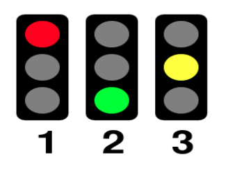

# Return Ready Lab 13

* Part A - Foundations


## Part B

### Activity 01: Next Color for a Stop Light

### Overview

The normal behavior for a stop light is to cycle from Red to Green To Yellow to Red ( and continues with this pattern). Complete `IfLight ` in the `part_b.activity02` package, which will determine the next color of a stop light in this pattern, Red to Green to Yellow to Red based on the current stop light provided by the user.



### Task

You must implement the following using a suitable `if` statement:

* Have the user enter the value for the currentColor.
* Compute the next color stop light based on the currentColor.
* Alert the user for any invalid value of color.

#### Expected Output 1

```
Enter a color code:
1
Next Traffic Light is green
```

#### Expected Output 2

```
Enter a color code:
3
Next Traffic Light is red.
```

#### Expected Output 3

```
Enter a color code:
0
Invalid color
```

#### Expected Output 4

```
Enter a color code:
4
Invalid color
```

### Activity 02: Next Color for a Stop Light

### Overview

Re-Write `IfLight` in `SwitchLight` in the `part_b.activity02` package, using a switch statement.


### Task

Implement all of the functionality in `IfLight` in `SwitchLight` , using siwtch statement and ensure the program alert users if they've entered any invalid value.